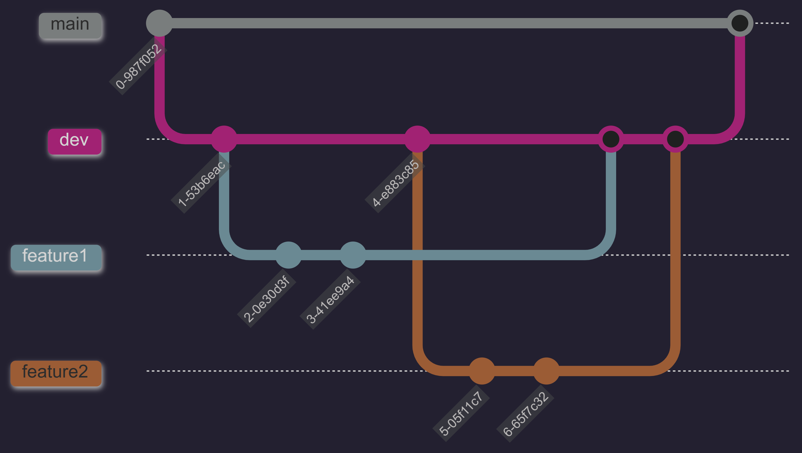

# 2026 1C - TP BACKEND
### Flujo de trabajo
Vamos a tener una rama dev en la cual vamos a mergear
las distintas funcionalidades, asi como tambien testearlas. Es decir, un ambiente de testing.
Mientras que en main va a estar todo el código ya funcionando.
Para mergear las ramas a dev lo haremos con pull request, y de dev a main tambien.
- `main`: Código estable y entregable.
- `dev`: Integración de funcionalidades.
- `feature`: Ramas de desarrollo personal.

[Enunciado](https://docs.google.com/document/d/1U5EYxgEFmlcIr6KldAwtHsrHBdGdVMfGUFunTRVTvwI/edit?usp=sharing)
